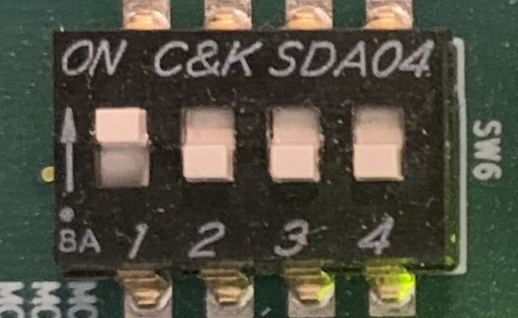

# RFSoC SDR
RFSoC SDR is an embedded lab for the [ZCU111 development board](https://www.xilinx.com/products/boards-and-kits/zcu111.html). It allows easy manipulation of 5 DACs and 1 ADC of the RFSoC by exploring operating modes and configuration parameters (Real, IQ, Sampling Rate, NCO, Interpolation, Decimation, Nyquist Zone, ...).

This project is part of an internship project conducted at the Instituto de Telecomunicações, Universidade de Aveiro, Campus Universitário de Santiago 3810 - 193 Aveiro, Portugal.

## ACKNOWLEDGMENT

I'd like to thank the strath-sdr lab and their documentation/open source project on RFSoC, which was a great learning support for the realization of this project.

* [strath-sdr](https://github.com/strath-sdr)
* [Commpy](https://github.com/veeresht/CommPy)
* [PYNQ](ttps://pynq.readthedocs.io/en/latest)

## Installation

Steps : 
* Format an SD card to FAT32 (e.g., using GParted).
* Install the PYNQ images for your baord : [pynq.io](https://www.pynq.io/boards.html)
* unzip it
* Flash the SD card with the PYNQ image (e.g., using Balena Etcher).
* Set the board switches for SD card usage, SW6 : (OFF = 1 = High, ON = 0 = Low) SD = OFF, OFF, OFFF, ON = 1110.!
* 
* Insert the card into your board.
* Plug the board to your Computer (ethernet cable).
* Start the board.
* Access from a browser at the address: 192.168.2.90 (you can change the static ip [here](https://pynq.readthedocs.io/en/v2.7.0/appendix/assign_a_static_ip.html))
WARNING: If you want the board to access the internet or you want to access it remotely in a lab, please consult your network supervisor.
* If you can't connect in this way, connect a usb cable (micro usb to usb) between the board and your computer and open a serial link terminal (e.g. with putty) with a baud rate of 115200 on one of the three COM ports (see /dev/ttyUSBx). You can then find out the correct ip with ifconfig cmd. (you can change the static ip [here](https://pynq.readthedocs.io/en/v2.7.0/appendix/assign_a_static_ip.html))
* Download this repository.
* Upload the rfsoc_sdr sub-folder tp Jupyter.
  

## Installing Dependencies

To update `numpy`, `scipy`, and `matplotlib`, and install `plotly` and `commpy`, run the following command:

```bash
pip install --upgrade numpy scipy matplotlib plotly scikit-commpy
```

## Important note

If you're using a loopback, you may need to add an attenuator (e.g. -5db).

## Resources

There are two folders: the `rfsoc_sdr` folder contains the source code and the bistream (and .hwh), and the `vivado` folder contains the vivado project (Vivado version: 2023.1).

## Code Documentation

Most functions are documented via a docstring or comments, so I'd advise you to look at the source code, as it's pretty straightforward. What's more, the best source of documentation will be the commented examples in notebook form that come with the source code. You can also go directly to the PYNQ source code, and in particular the RF Data Converter configuration methods ([xrfdc](https://github.com/Xilinx/PYNQ/tree/master/sdbuild/packages/xrfdc/package)).

## License

Copyright 2024 COLLIN Florian

Redistribution and use in source and binary forms, with or without modification, are permitted provided that the following conditions are met:

1. Redistributions of source code must retain the above copyright notice, this list of conditions and the following disclaimer.

2. Redistributions in binary form must reproduce the above copyright notice, this list of conditions and the following disclaimer in the documentation and/or other materials provided with the distribution.

3. Neither the name of the copyright holder nor the names of its contributors may be used to endorse or promote products derived from this software without specific prior written permission.

THIS SOFTWARE IS PROVIDED BY THE COPYRIGHT HOLDERS AND CONTRIBUTORS “AS IS” AND ANY EXPRESS OR IMPLIED WARRANTIES, INCLUDING, BUT NOT LIMITED TO, THE IMPLIED WARRANTIES OF MERCHANTABILITY AND FITNESS FOR A PARTICULAR PURPOSE ARE DISCLAIMED. IN NO EVENT SHALL THE COPYRIGHT HOLDER OR CONTRIBUTORS BE LIABLE FOR ANY DIRECT, INDIRECT, INCIDENTAL, SPECIAL, EXEMPLARY, OR CONSEQUENTIAL DAMAGES (INCLUDING, BUT NOT LIMITED TO, PROCUREMENT OF SUBSTITUTE GOODS OR SERVICES; LOSS OF USE, DATA, OR PROFITS; OR BUSINESS INTERRUPTION) HOWEVER CAUSED AND ON ANY THEORY OF LIABILITY, WHETHER IN CONTRACT, STRICT LIABILITY, OR TORT (INCLUDING NEGLIGENCE OR OTHERWISE) ARISING IN ANY WAY OUT OF THE USE OF THIS SOFTWARE, EVEN IF ADVISED OF THE POSSIBILITY OF SUCH DAMAGE.


